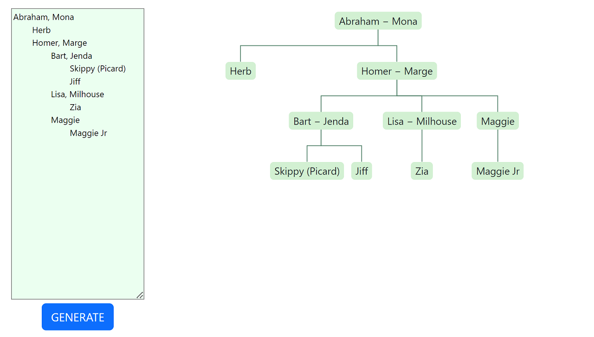

# Smorg

I made [SMORG](https://smorg.netlify.app/) to be a collection of coding ideas I want to try out. I also included links to projects I hosted external to Smorg.

## Not News Network

This is intended to be a mockup news site. All articles are completely made up. This site makes requests to Contentful for each article details. Clicking on an article opens a new page with the full article. Most other links are for show only.

    

## Family Tree

The text inside the textarea is converted to a family tree chart. The component TreeNodeComponent.tsx takes an array of TreeNodeComponent components to from a tree data structure, which the script uses recursion to populate. Tab indicates parent-child relationship. Comma indicates marriage. Any change made to the textarea automatically re-renders the tree chart. `react-xarrows` module was used to show the lines representing the parent-child relationships.

    

## Space

I haven't made up my mind about what I want this to be.

# External Links

Descriptions of the external projects can be found in [joooons.github.io](https://joooons.github.io/).

- Tetris
- Scatter!
- Imitation Go
- Vocab Helper
- Random Proverbs
